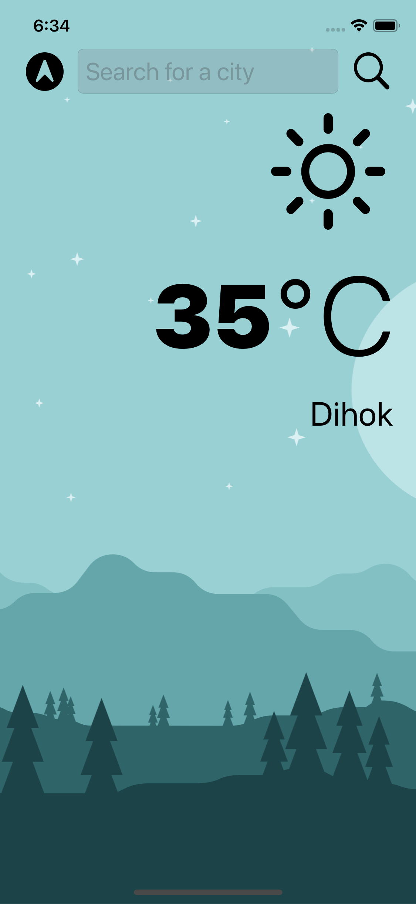
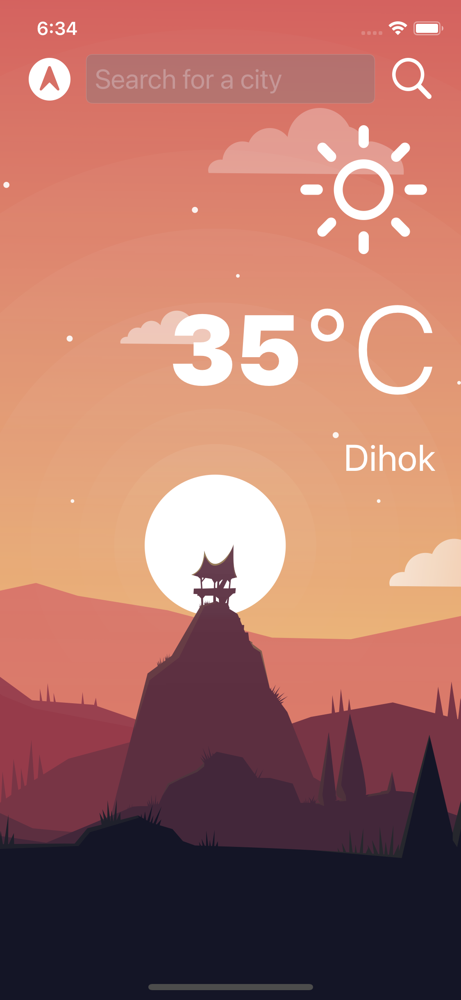

#  Clima

Clima is a simple weather app that lets you know about weather condition of your current location or anywhere.

## What I used on this app

* Dark Mode.
* UITextField to get user input. 
* Delegate pattern.
* URLSession to network and make HTTP requests.
* Parse JSON with the native Encodable and Decodable protocols. 
* Grand Central Dispatch (GCD) to fetch the main thread.
* Core Location to get the current location from the phone GPS. 

</img>
</img>